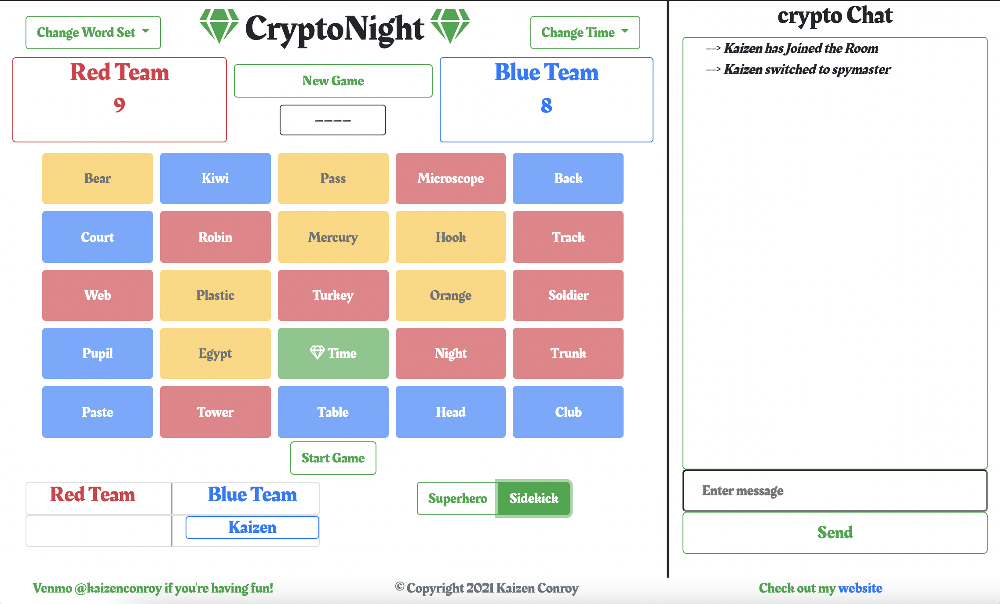
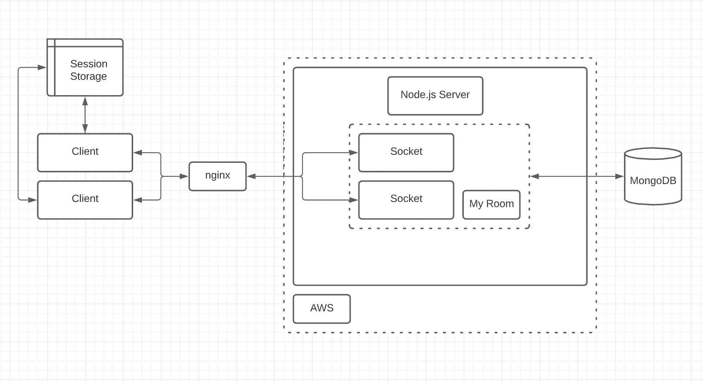

# Welcome to [CryptoNight!](https://cryptonight.codes)

## Visit the site - [cryptonight.codes](https://cryptonight.codes)

> How to play - [cryptonight.codes/rules](https://cryptonight.codes/rules)

> Check out the live leaderboard - [cryptonight.codes/leaderboard](https://cryptonight.codes/leaderboard)

> Join as a single player and find some friends - [cryptonight.codes/lobby](https://cryptonight.codes/lobby)

If you are a **recruiter** (hi!) or are interested in the technical features I implemented, please jump to [Features](https://github.com/kaizen3031593/code-words-game#features). If you are interested in the basic architecture of how it works, please jump to [How It works](https://github.com/kaizen3031593/code-words-game#how-it-works). Thanks for visiting, and if you like what you see, please star the repository or drop me some encouragement at zen.conroy@gmail.com.

## Inspiration

This is my take on the popular game, Codenames. I played it every week online with my family during the months of quarantine in 2020. We would play on the website [http://codewordsgame.com](http://codewordsgame.com), which serves as the initial inspiration for this project. However, I came across frustrating issues on that version where my timer was often incorrect leading to me running out of time before sending my clue. I decided it would be worthwhile to create a similar version of the game with my own personal take. 

Looking to spice up the game with a bit more of a theme, I landed on "CryptoNight." The idea is a superhero theme game where a team consists of a superhero and sidekick working to diffuse bombs and avoid the "cryptonight" word. 

I began this project with no prior experience building websites beyond a simple one-page React app for my personal portfolio. I greatly benefited from having a month free of responsibilities due to Covid-19 (January 2021) to research each step I took thoroughly. A few of my learnings are detailed in the "Some Thoughts" section below. With the belief that other aspiring developers could find themselves in my shoes at some point, I hope I can help by detailing my journey. 

## My Journey

My game is built off of a [tutorial](https://medium.com/better-programming/building-a-chat-application-from-scratch-with-room-functionality-df3d1e4ef662) to build a chat app. If you visit [cryptonight.codes](https://cryptonight.codes) and play the game you may see a version of the chat still exists. This was a wonderful start for me because it introduced **Socket.io** to me which is perhaps the most important piece of tech that my game runs on. **Socket.io** allows me to communicate to each player in the room and from player back to the server. My first deviation from the tutorial was to overhaul the CSS to **Bootstrap** and add the **MongoDB** database for persistent storage. Baby steps.

Perhaps the most perplexing to me was how to get my game running on a production server. To get the website on a production server I chose to use **AWS** as my cloud provider given my proximity as an 2020 AWS Summer SWE Intern. My application runs on the free-tier t2-micro **EC2** server. I created an **Elastic IP** address to make sure that my EC2 server always had the same public IP. I purchased a domain name ($35/year) and used AWS's DNS provider **Route 53** to connect that domain name to my Elastic IP. I also used **nginx** as a reverse proxy to direct both *http* and *https* requests to my nodejs server – something that codewordsgames.com did not do so at the very least CryptoNight is secure. I recommend following this [tutorial](https://www.digitalocean.com/community/tutorials/how-to-set-up-a-node-js-application-for-production-on-ubuntu-18-04), as I leaned on it heavily and follows the same steps I detailed.

## Technology Stack

To design the frontend, I used **Bootstrap** – I was semi-familiar with **Bootstrap** and **React/ElasticUI** but since I knew I needed a multiple page website I went with **Bootstrap**. I also used the **EJS** template to build the HTML and **Sortable.js** to allow users to drag-and-drop their icons to different teams. I also got my icons from **font awesome's** free tier, including my favicon, so credit where credit is due.

On the server side, I used **Node.js** with the **Express.js** web framework. **Express.js** helped me manage HTTP requests in the **Node.js** server. In addition, the node modules **body-parser** was used fo rhte middleware and **Socket.io** to communicate between the server and the (potentially) many browser rooms.

The database was handled by **MongoDB**. After looking at a few options, I turned to **MongoDB** because its document style database was similar to Javascript objects (JSON) and its free tier was more than enough for me. I used **MongoDB Atlas** to manage my database.

Handling my production server is an **AWS EC2** instance in the cloud. I've got an **Elastic IP** and a **Route 53 Hosted Zone** connecting the domain name to the EC2 instance. **nginx** is the reverse proxy that handles both *http* and *https* requests and reroutes them to the port that my node app is running on.

## How It Works

My knowledge of Systems Design tells me that I should avoid bottlenecks in the nginx reverse proxy as well as have duplicate MongoDB databases as a failsafe. However, since I am trying to stay under the free tier of many of these services and the traffic to my site as measured by google analytics is reasonably small, it is probably not necessary for the magnitude of my project.

## Some Thoughts

  - Migrating from my initial psuedo-database of Javascript object storages to **MongoDB** was not trivial and took two days. I had lots of issues with `async` and `await`.
  - If I were to start from scratch, I certainly would have used **Typescript** over **Javascript**. Often I wanted to keep my code more legible by declaring the types of my parameters but could not do so. By the time I realized this, I was in too deep.
  - I also could have spent more time researching a well-documented stack. I started with a vanilla tutorial and only considered a database from there. I should have started with full knowledge of the stack I was going to try, like the **MERN** stack. Funnily enough, I ended up quite close to that stack anyway.
  - I researched **Colyseus.io** after having completed a signficant portion of my project, so I didn't go in that direction. But the next time I use Node.js to build a game I would certainly start with that open-source library, which is like **socket.io** on steroids and made for online multiplayer games.
  - Without following extremely detailed tutorials on **DigitalOcean** for setting up a production server, I would have not been able to work through the multitude of challenges I faced configuring AWS and nginx. Even still, I had a misstep – I set up my firewall without allowing SSH access and locked myself out of my first EC2 server; I had to start over with a new one.
  
## Features

Here is a comprehensive list of non-trivial features implemented as part of this project:

**Home Page**

  - [x] Ability to create a room or join an existing one.
  - [x] Each roomname/username is checked for availability and profanity, with problematic instances returned as an "alert" to the user.

**Single Player Lobby**

  - [x] Functionality to enter lobby queue and be added to a room when the required 4 players are present.
  
**Rules**

  - [x] Progress bar that provides real time feedback to the user regarding how far they have scrolled.
  
**Leaderboard**

  - [x] Relevant all-time statistics for all players including _wins_, _losses_, _time/turn_, _correct guess percentage_, and much, much more.
  - [x] Responsive leaderboard can sort players on each individual statistic.
  
**Room**

  - **Chatbox**

  - [x] Live chatbox where users can communicate with each other, with profanity filtered.
  - [x] Commands including _/help_, _/stats_, _/stats superhero_, _/stats sidekick_, _/stats time_ that can be typed into the chatbox for real time statistics returned as a table in the chat.
  
  - **Settings**
  
  - [x] Drop-down settings for changing between multiple word sets and different timers.
  - [x] Team selection area where cards representing each player can be moved drag-n-drop style.
  - [x] Separate interfaces for "superhero" players and "sidekick" players toggled by a radio button.
  - [x] Changes are broadcast in the chatbox for all players to see.
  - [x] Randomize button that automatically sets a player for each of the 4 roles.
  
  - **Gameplay**
  - [x] Game settings become inactive when game starts.
  - [x] Each player's turn is managed by the game engine and their moves broadcast to the chat.
  - [x] Necessary statistics like time and correct/wrong clicks are harvested for later.
  - [x] Audio reminders for when time is almost up and when the "cryptonight" word is selected.
  
  - **Game Finish**
  - [x] Pop-up modal is created with information on which team won and statistic options for time per turn, superhero statistics, and sidekick statistics.

## Using this Repository

Just clone the repository and run `node install` and then `node app.js` in the terminal.

If this repository helped you or inspired you, or you're just feeling nice, please consider Starring the repository or contributing a Github Issue!
